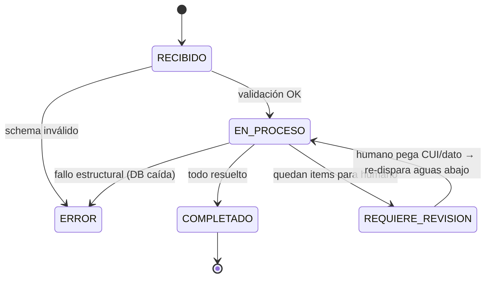

# Orquestador del pipeline — diseño

> **Qué resuelve**: los 8 componentes del backend ([mapa](README.md)) no se llaman
> en cascada a mano. Un **orquestador** los secuencia como un pipeline con estado,
> para tener todo *controlado*: reanudable si algo muere, reintenta lo transitorio,
> no se cuelga por un item que falla, y deja al humano solo lo irreducible.
>
> 🖼 Visual: [`orquestador.html`](orquestador.html) · Modelos: `backend/schemas/pipeline.py` + `enriquecimiento.py`

---

## 1 · Por qué un orquestador (y no llamadas en cascada)

El pipeline tiene propiedades incómodas que obligan a una capa de control:

| Propiedad | Implicación |
|---|---|
| Toca **portales externos** (SUNAT/InfoObras) que fallan transitoriamente | hace falta **retry con backoff** y no recolear lo ya hecho |
| Procesa **N experiencias** (decenas por propuesta) | **fan-out** por experiencia, con **límite de concurrencia** por fuente |
| Algunas experiencias **no resuelven solas** (CUI a revisión, emisor sin RUC) | **human-in-the-loop**: no bloquear el job, entregar lo demás |
| Un análisis puede tardar y el proceso **puede morir** | **checkpoint por etapa** → reanudable |
| El panel muestra avance | **eventos de progreso** (websocket) por etapa/lote |

El orquestador es el **plano de control**; los 8 componentes son el **plano de datos**.

## 2 · Máquina de estados del job



- **`ERROR`** se reserva para fallos **estructurales** (schema inválido, base de datos
  caída). Un scraper que falla en *una* experiencia **no** lleva el job a ERROR → marca
  esa experiencia y sigue (`ERROR_PARCIAL` en la etapa).
- **`REQUIERE_REVISION`** es un estado *terminal-suave*: el Excel se entrega con lo
  resuelto + la lista de pendientes. No es un error; es el flujo normal del ~5-15%
  irreducible (CUI ambiguo, obra fuera de InfoObras, emisor sin RUC).

## 3 · Contrato de etapa (idempotente)

Cada componente se implementa como una **etapa** con la misma firma. Esto es lo que
permite checkpoint, reintento y reanudación uniformes:

```python
class Etapa(Protocol):
    nombre: pipeline.Etapa
    def correr(self, ctx: Contexto) -> pipeline.ResultadoEtapa: ...
    # ctx.espejo  : JsonEspejo (mutable: la etapa escribe su enriquecimiento)
    # ctx.job     : Job (estado persistente)
    # ctx.fuentes : clientes SUNAT/InfoObras con cache + semáforo
```

Reglas del contrato:
1. **Idempotente**: correr la etapa dos veces con la misma entrada da el mismo
   resultado (cache de queries evita recolear). Reanudar = volver a correr sin daño.
2. **No lanza por item**: un fallo de un item → `metrica.items_error += 1` y
   `EstadoEtapa.ERROR_PARCIAL`; solo un fallo estructural lanza → `JobEstado.ERROR`.
3. **Acumula, no pisa**: agrega `Observacion`/`ItemRevision`; no borra lo previo.
4. **Escribe checkpoint**: al terminar persiste su `ResultadoEtapa` en el `Job`.

## 4 · Lo que el orquestador garantiza (control)

```
INGESTA → VALIDACIÓN → RESOLUCIÓN_CUI ─┬─► INFOOBRAS ─┐
                                       └─► SUNAT ──────┴─► REGLAS → EXCEL → PERSISTENCIA
                                       └────────────── fan-out por experiencia ──────────┘
   ▲ checkpoint tras cada etapa   ▲ retry+backoff por request   ▲ semáforo por fuente
```

- **Checkpoint / reanudable**: tras cada etapa se persiste `ResultadoEtapa`. Si el
  proceso cae, el orquestador reanuda saltando las etapas con estado `OK`.
- **Reintentos**: los requests a SUNAT/InfoObras reintentan (3×, backoff) ante
  timeouts; el fallo transitorio **no se cachea**. (El matcher de CUI ya lo hace.)
- **Fan-out con límite por fuente**: las experiencias se resuelven/cruzan en paralelo,
  pero un **semáforo** acota requests concurrentes por portal (ej. máx 4 a InfoObras)
  para no saturarlo ni gatillar bloqueos.
- **InfoObras ∥ SUNAT**: las dos ramas de la etapa de cruce son independientes
  (CUI vs RUC) → corren en paralelo; REGLAS las espera (necesita las paralizaciones).
- **Progreso**: tras cada etapa/lote se emite `ProgresoJob` por websocket.

## 5 · Human-in-the-loop (el bucle de control)

```
RESOLUCIÓN_CUI → item sin candidato fiable → ItemRevision{ motivo, candidatos[], acción }
        │                                          │
        └── el job continúa con el resto ──────────┘
                          │
   panel: humano pega el CUI  →  re-dispara SOLO esa experiencia desde INFOOBRAS
                          │       (no re-procesa todo el job)
                          ▼
              REGLAS → EXCEL se regeneran  →  COMPLETADO
```

- Un `ItemRevision` lleva los **candidatos** que el sistema encontró → el humano
  confirma o pega el dato; nunca parte de cero.
- Al resolverse, se re-ejecutan **solo las etapas aguas abajo** de esa experiencia
  (gracias a la idempotencia + checkpoint), no el análisis completo.

## 6 · Modelo de fallos (resumen)

| Fallo | Alcance | Estado resultante |
|---|---|---|
| Schema del JSON inválido | job | `JobEstado.ERROR` (aborta en INGESTA) |
| Timeout puntual de un scraper | request | reintento; si persiste → `items_error` del item |
| Una experiencia sin CUI fiable | item | `ItemRevision` → `REQUIERE_REVISION` (no bloquea) |
| InfoObras devuelve >1 obra por CUI | item | `InfoObrasResultado.obras_multiples=True` + observación |
| Emisor sin RUC consultable (persona natural) | item | `SunatResultado.requiere_humano=True` |
| Base de datos / disco caído | job | `JobEstado.ERROR` (estructural) |

## 7 · Mapa a los modelos Pydantic

| Concepto | Modelo (`backend/schemas/`) |
|---|---|
| Estado del análisis (registro PostgreSQL) | `pipeline.Job` |
| Etapas del pipeline (orden canónico) | `pipeline.Etapa` |
| Checkpoint por etapa | `pipeline.ResultadoEtapa` + `MetricaEtapa` |
| Máquina de estados | `pipeline.JobEstado` / `EstadoEtapa` |
| Hallazgo del validador/cruces | `pipeline.Observacion` (+ `Severidad`) |
| Pendiente humano | `pipeline.ItemRevision` |
| Evento websocket | `pipeline.ProgresoJob` |
| Resolución de CUI (comp. 2) | `enriquecimiento.ResolucionObra` (+ `Candidato`, vías, decisiones) |
| InfoObras (comp. 3a) | `enriquecimiento.InfoObrasResultado` (+ `Paralizacion`) |
| SUNAT (comp. 3b) | `enriquecimiento.SunatResultado` (+ `Representante`) |
| Reglas / Paso 5 (comp. 4) | `enriquecimiento.ReglasResultado` (+ `DiasEfectivos`) |
| Bloque `_backend` tipado (filled) | `enriquecimiento.EnriquecimientoExperiencia` |

> El placeholder plano `Backend` de `espejo.py` es el **contrato vacío** que Claude
> emite (todo `null`); el orquestador lo reemplaza por el `EnriquecimientoExperiencia`
> estructurado al pasar por las etapas.

## 8 · Dónde vive

En `Alpamayo-InfoObras`, sobre la infra existente: `src/api/main.py` ya tiene el job
system + websockets (se le agrega el tipo `analyze` y la máquina de estados); los
componentes reusan `src/scraping/*` y `src/validation/rules.py`. El orquestador es la
**pieza nueva de cableado** que los pone en secuencia controlada.
